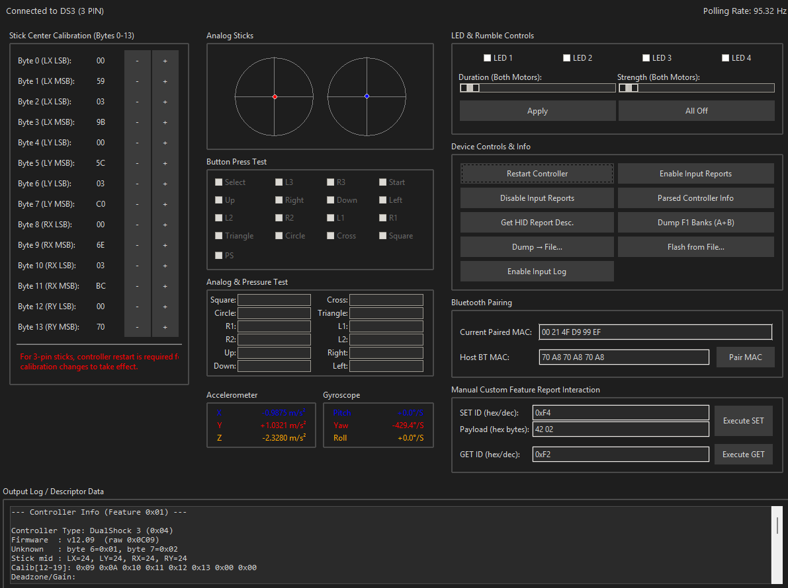

# DS3 Input & Report Inspector

A comprehensive Python-based GUI tool for inspecting, testing, and interacting with Sony DualShock 3 (DS3/SIXAXIS) controllers connected via USB. This application allows users to view real-time input data, control LEDs and rumble, manage various HID feature reports, dump and flash controller memory (including stick calibration data), and manage Bluetooth pairing.

# Why is the app size larger than expected?
This application is packaged using [PyInstaller](https://www.pyinstaller.org/), which bundles a full Python runtime and all required dependencies into a single executable. As a result, the final package size is bigger than if this were a “native” application. The benefit is that you do not need to install Python separately in order to run the app—all necessary components are included out of the box.

# Why do some antivirus programs flag the `.exe` as a virus?
Some antivirus software may falsely flag executables created by PyInstaller as potentially harmful. This is a known issue and is typically a **false positive**. If you are concerned, you can:
1. **Inspect or run the source code** using Python directly (no installer needed).
2. **Build the executable yourself** using PyInstaller.
3. Scan it with multiple antivirus engines to rule out any genuine threat.

# Can I run it without the large executable?
1.Download and install python

2.Create a folder on disk C like DS3_Input_And_Report_Inspector

3.Extract the downloaded code to C:\DS3_Input_And_Report_Inspector

4.Open terminal and write "cd C:\DS3_Input_And_Report_Inspector"

5.Create new python virtual enviorment in your current location: python -m venv venv

6.Activate virtual enviorment: .\venv\Scripts\activate

7.Install requirements: pip install -r requirements.txt

8.Run the script: python DS3_Input_And_Report_Inspector.py

## Donations

I’m sharing this for the benefit of the community. If you find it helpful, please credit my work. If you’d like to support future developments (or just buy me a coffee), you can donate here:

https://www.paypal.com/donate/?business=CV5LLN6DKMGYC&no_recurring=0&currency_code=USD

## Features

*   **Real-time Input Display:**
    *   Digital button states (D-Pad, Face buttons, Shoulder buttons, Stick presses, PS button).
    *   Analog stick positions visualized on 2D pads.
    *   Pressure-sensitive button values displayed with progress bars.
    *   Motion sensor data (Accelerometer, Gyroscope) with raw and processed values (m/s², °/S), utilizing fetched calibration data.
*   **Output Control:**
    *   Individually toggle LEDs (Player 1-4).
    *   Control rumble motor duration and strength for both motors.
*   **Feature Report Management:**
    *   Fetch and display parsed common Feature Reports:
        *   `0x01`: Controller Type, Firmware, Stick Midpoints, Deadzone/Gain.
        *   `0xF2`: Bluetooth MAC, Serial Number, PCB Revision.
        *   `0xEF`: Motion Sensor Calibration data (Accelerometer Bias/Gain, Gyro Z-offset).
    *   Manually GET any Feature Report by ID and view raw data.
    *   Manually SET any Feature Report by ID with a custom hex payload (use with caution!).
*   **HID Report Descriptor:**
    *   Fetch and display the raw HID Report Descriptor for the device.
*   **Bluetooth Pairing (Report 0xF5):**
    *   View the currently paired Bluetooth MAC address stored on the controller.
    *   Set a new host Bluetooth MAC address to pair the controller.
*   **Flash Memory Utilities (Report 0xF1):**
    *   Dump entire flash banks A & B (512 bytes total) to a `.bin` file.
    *   Write flash banks A & B from a `.bin` file back to the controller ( **EXTREME CAUTION ADVISED**).
    *   View raw hex dump of flash banks A & B directly in the GUI.
    *   Probe flash memory pages with write-then-read tests.
*   **Stick Center Calibration (Report 0xF1, Bank A, Offset 0x0020):**
    *   View the 16-byte stick center calibration data segment.
    *   Adjust individual bytes (B0-B7) of the primary 8-byte (16-byte for controllers that use 3 pin analog sticks) calibration data and write changes back to the controller.
*   **Controller Commands:**
    *   Send a restart command to the controller.
    *   Enable/Disable input report streaming (requires PS button press to activate streaming after enabling).
*   **Diagnostics & UI:**
    *   Displays current USB polling rate.
    *   Connection status indicator.
    *   Option to log detailed input report data to the console.
    *   Automatic reconnection attempts.

## Requirements

*   A `libusb` backend:
    *   **Windows:** WinUSB, libusb-win32, or libusbK. **Zadig** is commonly used to install one of these drivers for the DS3 controller (see Installation).

## Installation

1.  **Set up libusb backend driver (IMPORTANT for Windows):**
    *   **Windows:**
        *   The standard DS3 drivers (like SCP Toolkit, DsHidMini, or Sony's official drivers if you used them) typically **will not work** with PyUSB for direct device access. You need to replace the driver for the DS3's USB interface with WinUSB, libusb-win32, or libusbK.
        *   Download **Zadig** ([https://zadig.akeo.ie/](https://zadig.akeo.ie/)).
        *   Connect your DS3 controller.
        *   Open Zadig. Go to `Options -> List All Devices`.
        *   Select your "PLAYSTATION(R)3 Controller" or similar device from the dropdown.
            *   Ensure the USB ID matches `054C:0268`.
        *   Choose `WinUSB` (recommended), `libusb-win32`, or `libusbK` from the driver list to the right of the green arrow.
        *   Click "Replace Driver" or "Install Driver".
        *   **WARNING:** This will make the controller unusable by normal gaming drivers/applications until you uninstall the Zadig-installed driver and restore the original one.

## Usage

1.  Connect your DS3 controller to your computer via USB.
2.  Ensure the correct `libusb` backend driver is active for the controller (especially on Windows, as per Installation steps).
3.  Navigate to the cloned repository directory in your terminal.
4.  Run the DS3 Input & Report Inspector.exe.
5.  The application will launch and attempt to connect to the DS3 controller.
6.  If input data (sticks, buttons, etc.) does not appear immediately after connection, **press the PS button** on the controller. This is often required to start the data stream.
7.  Use the various GUI elements to inspect data, send commands, and test features.

## Custom commands

Custom command to write to the controller memory folow this paterns:

## Key Functionalities Explained

*   **Input Inspection:** The left and center panels provide real-time feedback on all controller inputs. This is useful for diagnosing faulty buttons, stick drift, or sensor issues.
*   **Feature Reports:** These are HID reports used for configuration and status. This tool allows you to read known reports (like firmware version or MAC address) and experiment with undocumented ones using the "Manual Custom Feature Report Interaction" section.
*   **Flash Memory (0xF1):** The DS3 controller has internal flash memory storing calibration, pairing data, and firmware settings.
    *   **Dumping:** You can back up the controller's flash content. This is useful for analysis or safekeeping before making changes.
    *   **Flashing:** You can write data from a `.bin` file back to the controller. **This is extremely risky and can brick your controller if incorrect data is written.** Only proceed if you know exactly what you are doing and have a valid dump.
*   **Stick Center Calibration (0xF1, Bank A, Offset 0x0020):** The first 8 bytes at flash address `0x0020` in Bank A store the center calibration values for the analog sticks (LX LSB, LX MSB, LY LSB, ..., RY MSB). The following 8 bytes are related suffix/checksum data. This tool allows direct modification of the primary 8 bytes.
    *   Changes are written directly to the controller's flash. Adjust small amounts and test.
    *   **Caution:** Incorrect values can make sticks unusable. Always back up your flash first.
*   **Bluetooth Pairing (0xF5):** Report `0xF5` is used to set the Bluetooth MAC address of the host PC that the controller should pair with.
    *   The tool automatically tries to detect your host PC's Bluetooth MAC, but **you should always verify and correct this value manually** if needed, as auto-detection can be unreliable.
    *   After setting the MAC, you typically need to disconnect the USB cable and press the PS button for the controller to attempt a Bluetooth connection (On windows this wont work without custom driver and L2CAP patch).
*   **LED & Rumble:** Test basic output functionality. The LED pattern corresponds to player numbers (LED1 for P1, etc. Rumble will need some changes at its a liitle broken now).

## Troubleshooting & Notes

*   **Controller Not Found:**
    *   Ensure the controller is securely connected via USB.
    *   **Windows:** Verify you have installed WinUSB (or similar) using Zadig for the DS3 device.
*   **No Input Data / Polling Rate 0 Hz (but connected):**
    *   Press the **PS button** on the controller. This is usually required to initiate the input data stream after the initial USB handshake.
*   **Failed to Claim Interface / Resource Busy:**
    *   Another application (e.g., a game, another DS3 driver tool) might be using the controller. Close other relevant applications.
    *   On Windows, this can also indicate the Zadig driver setup was incomplete or another driver like DsHidMini is actively managing the device.
*   **Windows Driver Warning:** Using Zadig to install WinUSB/libusbK will make the DS3 controller **unusable for standard gaming** (e.g., with XInput wrappers like SCP Toolkit or DsHidMini in its default mode) until the original driver is restored or the Zadig-installed driver is uninstalled.
*   **Caution with Write Operations:** Modifying flash memory (general flashing, stick calibration writes) or sending arbitrary SET_REPORT commands can be **dangerous and potentially render your controller unresponsive (brick it)**. Always back up your controller's flash memory before attempting writes if possible, and proceed with extreme caution.
*   **Motion Sensor Values:** The displayed m/s² and °/S values depend on fetched calibration data (Report 0xEF) and predefined sensitivity constants. These provide a good approximation but might vary slightly between controllers. The physical-to-display axis mapping for accelerometers (e.g., which physical axis corresponds to the 'Y' label showing gravity) has been configured based on common observations but might need adjustment if your controller behaves differently.

## License

This project is licensed under the MIT License.

## Acknowledgements

*   This tool is created by lewy20041.
*   Relies on the PyUSB library for USB communication.
